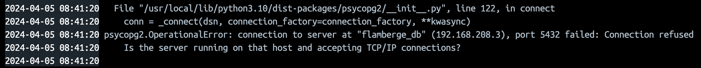
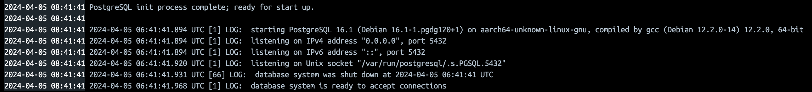
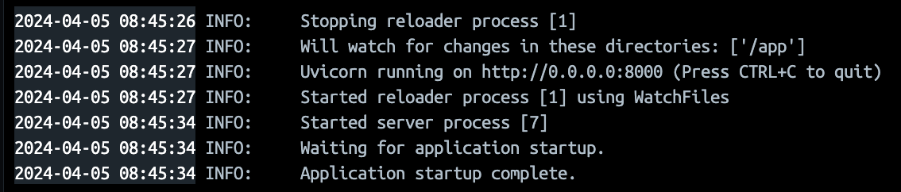
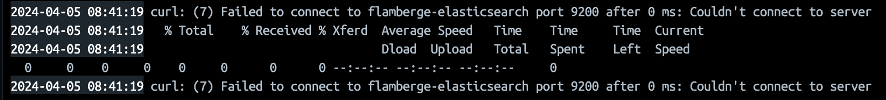
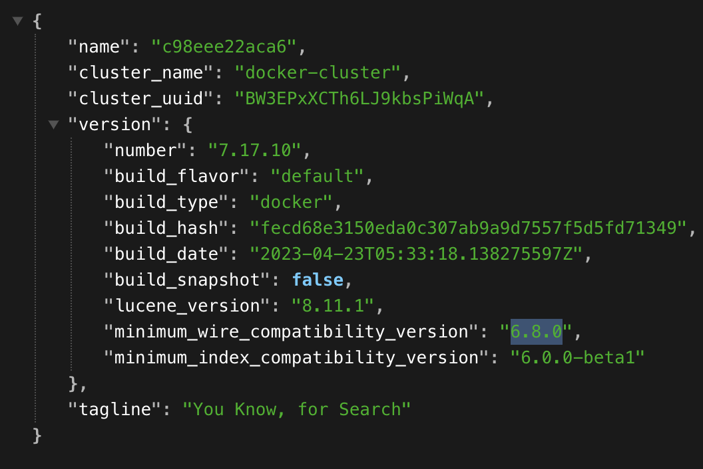
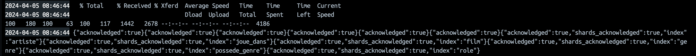

# Guide d'installation et d'utilisation - Projet Flamberge

Ce guide fournit des instructions pour configurer et exécuter l'environnement Docker pour le projet Flamberge.

## Prérequis

Assurez-vous d'avoir Docker et Docker Compose installés sur votre système.

- Docker : [Guide d'installation Docker](https://docs.docker.com/get-docker/)
- Docker Compose : [Guide d'installation Docker Compose](https://docs.docker.com/compose/install/)

## Configuration

1. Clonez ce dépôt sur votre machine locale :

   ```bash
   git clone <URL_DU_REPO> flamberge
   ```

2. Accédez au répertoire du projet :

   ```bash
   cd flamberge
   ```

3. Modifiez les fichiers de configuration si nécessaire :

   - `FlambergeDB/init.sql` : Vous pouvez ajouter des scripts SQL d'initialisation de la base de données si besoin.
   - `FlambergeElastic/mapping.json` : Vous pouvez modifier le mapping d'index Elasticsearch si nécessaire.

## Installation

1. Lancez les conteneurs Docker en utilisant Docker Compose :

   ```bash
   docker-compose up -d
   ```

   Cela construira et lancera les conteneurs définis dans le fichier `docker-compose.yml`.

2. Vous pouvez relancez certains conteneur, par exemple pour relancer l'API pour qu'elle se connecte à une nouvelle base de données, exécutez la commande suivante:

   

   Vous pouvez voir que l'API est en cours d'exécution et qu'elle attend de se connecter à la base de données.

   

   Dans les logs de flamberge-db, vous pouvez voir que la base de données a fini son initialisation comme ceci.

   ```bash
   docker restart flamberge_api
   ```

   

   Ici L'API est relancée et connectée à la base de données.

3. Pour finir vous pouvez relancer le conteneur elastic_mapping pour qu'il se connecte à elasticsearch et dans ce cas présent nous crée le mapping pour pouvoir utiliser l'autocomplétion dans la barre de recherche:

   

   Dans les logs de flamberge-elastic_mapping, vous pouvez voir que le mapping n'a pas encore pu se connceter au port ouvert par elastic.

   

   Sur le port localhost:9200 vous pouvez voir que elastic est bien lancé alors vous pouvez relancer le mapping comme ceci :

   ```bash
   docker restart flamberge_elastic_mapping
   ```

   Dans les logs de flamberge-elastic_mapping, vous pouvez voir que le mapping a cette fois ci pu se connecter à elastic.

   

4. Une fois que elasticsearch est lancé, vous pouvez relancer le conteneur logstash pour qu'il se connecte à elasticsearch, et indexe tout les données:

   ```bash
   docker restart flamberge_logstash
   ```

## Utilisation

- L'API est accessible à l'adresse : `http://localhost:8081`
- L'application Web est accessible à l'adresse : `http://localhost:8080`
- Elasticsearch est accessible à l'adresse : `http://localhost:9200`
- Kibana est accessible à l'adresse : `http://localhost:9201`

## Arrêt et Nettoyage

Pour arrêter les conteneurs Docker, exécutez la commande suivante :

```bash
docker-compose down
```
